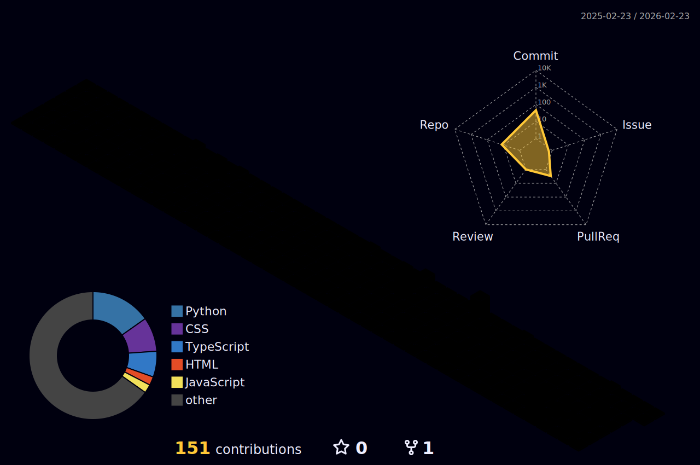

  

<h1 align="center">👋 Hello, I'm Sabin Anwar!</h1>

  

  
  
  
  
  

  <a href="#-about-me">About Me</a> •
  <a href="#-tech-stack">Tech Stack</a> •
  <a href="#-github-stats">GitHub Stats</a> •
  <a href="#-activity-overview">Activity Overview</a> •
  <a href="#-visual-showcase">Visual Showcase</a> •
  <a href="#-featured-projects">Featured Projects</a> •
  <a href="#-connect-with-me">Connect</a>

---

## 🌸 About Me

As a dedicated **Dual Student in Business Informatics**, my professional journey is centered around the intersection of technology and business. I am deeply committed to developing **clean, efficient code** that underpins **usable products** and **elegant user interfaces**. My expertise is versatile, encompassing robust **backend development** with **Java and Spring Boot**, alongside dynamic **frontend solutions** built with **React and TypeScript**.

Beyond development, I excel in **Business Intelligence (BI)** and **Data Quality**, leveraging tools like **Power BI** to transform complex data into compelling **data storytelling**. My core interests include championing **usability (aligned with ISO 92441 standards)**, advocating for **accessible design**, and implementing **clean architecture** principles to deliver software that is both powerful and intuitive.

---

## 🧰 Tech Stack & Tools

I actively work with a diverse set of technologies to bring ideas to life:

  
  
  
  
  
  
  
  
  

---

## 📈 GitHub Stats & Contributions

My journey and progress on GitHub, visualized:

  
  

  

---

## 📊 Activity Overview

An insight into my recent coding activities and contributions:

  

---

## ✨ Visual Showcase

Adding a touch of visual flair to my profile:

  <!-- 3D contributions (local file generated by yoshi389111/github-profile-3d-contrib) -->
  

  <!-- Snake (choose ONE source: output branch OR local folder on main) -->
  

  

---

## 📚 Featured Projects

A selection of projects that highlight my skills and interests:

*   👗 **Fashion-AI-App** — An innovative AI-powered application designed to provide intelligent outfit suggestions. This project integrates **Java** for robust backend logic, **React** for a dynamic user interface, and **Business Intelligence** principles for data-driven recommendations.
*   🧭 **Burnout Data Analysis** — A comprehensive data analysis project focused on exploring and understanding trends related to professional burnout, utilizing various data science techniques.
*   🧼 **Data-Quality-BI Dashboards** — Development of interactive **Power BI dashboards** that incorporate advanced data quality checks, ensuring the reliability and accuracy of business insights.

---

## 🤝 Connect With Me

I am always eager to connect with fellow professionals, collaborate on exciting projects, or discuss new ideas. Feel free to reach out through the following channels:

  
  
  

<i>“Build with clarity. Design with empathy. Ship with pride.”</i> ✨

  

