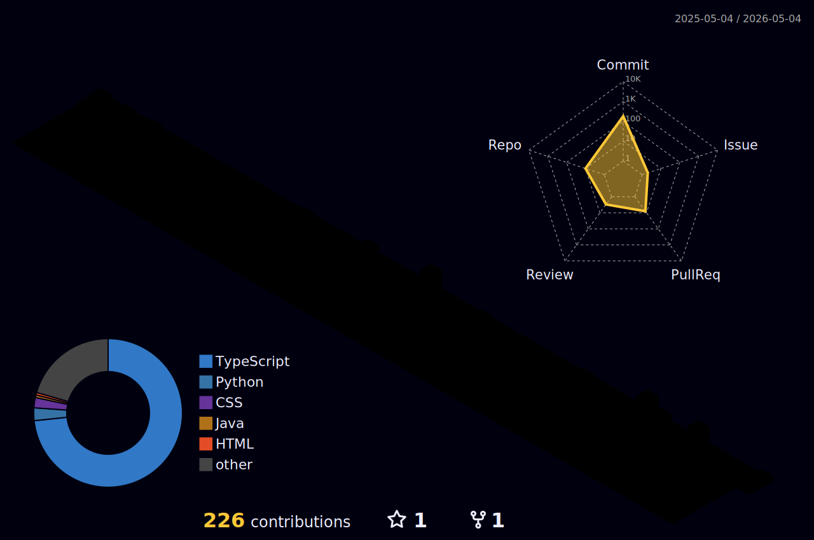

  

<h1 align="center">Sabin Anwar</h1>

<b>Business Informatics Student | Full-Stack Developer | BI Enthusiast | She/Her</b>

  

  
  
  

  <a href="#about">About</a> •
  <a href="#core-strengths">Core Strengths</a> •
  <a href="#technology-stack">Tech Stack</a> •
  <a href="#featured-projects">Projects</a> •
  <a href="#github-analytics">GitHub Analytics</a> •
  <a href="#contact">Contact</a>

---

## About

I am a **Dual Student in Business Informatics** with a strong focus on building software that is both technically solid and useful for people.

I combine:
- **Backend engineering** with Java and Spring Boot
- **Frontend development** with React and TypeScript
- **Business Intelligence and data quality** with Power BI and structured analysis

My goal is to contribute to teams that value clean architecture, usability, and measurable business impact.

---

## Core Strengths

- Designing and implementing maintainable full-stack applications
- Translating business requirements into practical technical solutions
- Building intuitive, accessible user interfaces with a usability-first mindset
- Creating dashboards and reports that improve decision-making quality
- Working in collaborative environments with Git, Jira, and agile workflows

---

## Technology Stack

  
  
  
  
  
  
  
  
  

---

## Featured Projects

### 1. Fashion-AI-App
**Focus:** AI-assisted recommendations, full-stack architecture, practical UX

Built an application that combines backend logic and frontend interaction to deliver intelligent outfit suggestions.

**Tech:** Java, React, Business Intelligence concepts

### 2. Burnout Data Analysis
**Focus:** data exploration, insight extraction, storytelling

Analyzed burnout-related data to identify patterns and support evidence-based conclusions.

**Tech:** Data analytics workflows, BI thinking

### 3. Data-Quality BI Dashboards
**Focus:** reliable reporting, quality checks, actionable metrics

Created Power BI dashboards with integrated data quality controls to improve trust in reported KPIs.

**Tech:** Power BI, data quality methods

---

## GitHub Analytics

  
  

  

  

  

  

  

---

## Contact

  

For professional inquiries, please connect with me via GitHub.

<i>Clean code. Thoughtful design. Business value.</i>

  

