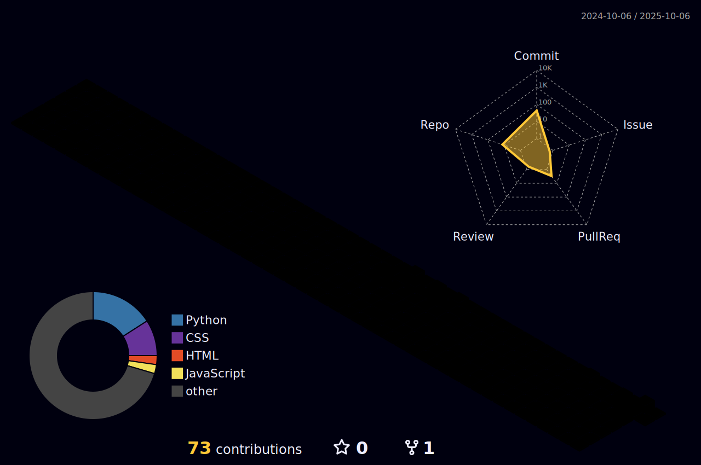

<!-- =======================  PINK WAVE BANNER  ======================= -->

  

<!-- =======================  TYPING INTRO  ======================= -->

  

<!-- =======================  BADGES  ======================= -->

  
  
  
  

<!-- =======================  QUICK NAV  ======================= -->

  <a href="#-about-me">About</a> •
  <a href="#-tech-stack">Tech</a> •
  <a href="#-highlights--stats">Stats</a> •
  <a href="#-activity">Activity</a> •
  <a href="#-animations">Animations</a> •
  <a href="#-featured-projects">Projects</a> •
  <a href="#-connect">Contact</a>

---

### 📊 Profile Metrics

  <!-- Local file generated by lowlighter/metrics workflow -->
  

---

### 🌸 About me
- 🎓 Dual student in **Business Informatics**
- 💼 Backend: **Java / Spring Boot** · Frontend: **React / TypeScript**
- 📊 **BI & Data Quality** · Power BI · Data storytelling
- 🧠 Interests: **Usability (ISO 9241)**, accessible design, clean architecture

---

### 🧰 Tech Stack

  
  
  
  
  
  
  

---

### 📈 Highlights & Stats

  
  

  

---

### 📈 Activity

  

---

### ✨ Animations

  <!-- 3D contributions (local file generated by yoshi389111/github-profile-3d-contrib) -->
  

  <!-- Snake (choose ONE source: output branch OR local folder on main) -->
  <!-- If you publish to an output BRANCH via the Action, use this: -->
  
  <!-- If you keep snake.svg in /output on main, replace the line above with: -->
  <!--  -->

---

### 🏆 Trophies

  

---

### 📚 Featured Projects
- 👗 **Fashion-AI-App** — AI outfit suggestions (Java + React + BI)
- 🧭 **Burnout** — Burnout Data Analysis
- 🧼 **Data-Quality-BI** — Power BI dashboards with data checks

---

### 🤝 Connect

  
  

<i>“Build with clarity. Design with empathy. Ship with pride.”</i> ✨

<!-- =======================  FOOTER WAVE  ======================= -->

  

