<!-- Animated header -->

  

<!-- subtle wave gif -->

  

  
  
  

---

### 📊 Profile Metrics

  

---

### 🌸 About me
- 🎓 Dual student in **Business Informatics**
- 💼 Backend: **Java / Spring Boot** · Frontend: **React / TypeScript**
- 📊 **BI & Data Quality** · Power BI · Data storytelling
- 🧠 Interests: **Usability (ISO 9241)**, accessible design, clean architecture

---

### 🧊 3D Contributions

  

---

### 🧰 Tech Stack

  
  
  
  
  
  
  

---

### 📈 Highlights & Stats

  
  

  

---

### 🐍 Animated Contribution Snake

---

<!-- Animated banner -->

  

---

### 📈 Activity

  

---

### 🏆 Trophies

  

---

### 📚 Featured Projects
- 👗 **Fashion-AI-App** — AI outfit suggestions (Java + React + BI)
- 🧭 **Burnout** — Burnout Data Analysis
- 🧼 **Data-Quality-BI** — Power BI dashboards with data checks

---

### 🤝 Connect

  
  

<i>“Build with clarity. Design with empathy. Ship with pride.”</i> ✨

